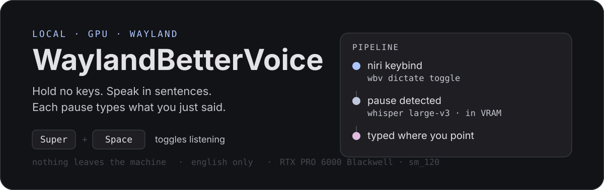

<p align="center">
  
</p>

<p align="center">
  <a href="#requirements"></a>
  <a href="#requirements"></a>
  <a href="#requirements"></a>
  <a href="#privacy"></a>
  <a href="LICENSE"></a>
</p>

Press `Super+Space`, talk normally, and every time you pause, that sentence is typed
into whatever window has focus. Press it again to stop listening. A second binding
records meetings and writes a speaker-labelled transcript, tagging each remote
participant separately even when they all arrive on one audio stream.

Whisper `large-v3` is loaded into VRAM when your session starts and stays resident, so
there is no model load between you pressing the key and speaking. Nothing is ever sent
anywhere: no API keys, no accounts, no network calls.

---

## ⚠️ Built for one machine

This is **not** a general-purpose Linux dictation tool. It was written for, and is only
tested on, a single very specific setup:

| | |
|---|---|
| **GPU** | NVIDIA **RTX PRO 6000 Blackwell** — compute capability **12.0 (`sm_120`)** |
| **OS** | CachyOS (Arch Linux), Python 3.14, system packages only — no venv, no pip |
| **Compositor** | niri 26.04, strict Wayland (no X11 fallback) |
| **Shell** | Noctalia 4.7.7 / quickshell 0.0.12 — required only for the overlay |
| **Audio** | PipeWire 1.6.8 |

The critical constraint is the GPU. This depends on a **Blackwell-specific build of
`python-pywhispercpp` compiled with `CMAKE_CUDA_ARCHITECTURES=120`** — it contains
`sm_120` kernels and nothing else. On a 30-series, 40-series, or any pre-Blackwell card
it will not run until you rebuild the CUDA package for your own architecture. On AMD,
Intel, or CPU-only it will not run at all.

If you have different hardware you are welcome to fork it, but expect to change the
CUDA arch, the audio node resolution, and the VAD thresholds. See
[Porting](#porting-to-other-hardware).

---

## Install

Requires the Blackwell CUDA whisper build to exist first (see above).

```bash
git clone https://github.com/itc-steve/WaylandBetterVoice.git
cd WaylandBetterVoice/packaging
./install-local.sh          # --check first for a dry run
```

Then:

```bash
# 1. daemon — loads the model into VRAM at session start
systemctl --user enable --now waylandbettervoice.service

# 2. keybinds — the installer copies the snippet but never edits your config
#    add this line to ~/.config/niri/config.kdl yourself:
#      include "./cfg/waylandbettervoice.kdl"
niri validate

# 3. overlay (optional, needs Noctalia)
ln -s /usr/share/waylandbettervoice/noctalia-plugin \
      ~/.config/noctalia/plugins/waylandbettervoice
```

Enable the plugin in Noctalia's settings, then add the **WaylandBetterVoice** widget to
your bar.

The installer symlinks any existing whisper models it finds rather than re-downloading
them, and refuses to run as root.

## Use

| Bind | Action |
|---|---|
| `Super+Space` | Start / stop listening. While listening, each pause types a sentence. |
| `Super+Alt+Space` | Start / stop recording a meeting. |
| `Super+Alt+X` | Cancel dictation without typing anything. |

Everything is also available on the CLI and from the bar widget:

```bash
wbv dictate toggle      # or start / stop / cancel
wbv meeting toggle      # or start / stop
wbv status --json
```

### Dictation

Listening mode is continuous. You are not holding a key and you are not pressing stop
between sentences — speak, pause for about `0.8s`, and the text appears. The mic stays
open until you toggle off.

Near-silent audio is discarded rather than transcribed, because whisper reliably
hallucinates phrases like *"Thank you."* when handed silence.

### Meetings

A meeting records two streams: your microphone (always labelled `Me`) and system audio
— the one stream carrying every remote participant. Speaker embeddings split that stream
into `Speaker 1`, `Speaker 2`, and so on, so a five-person call does not collapse into a
single block of text.

Each meeting writes a folder to `~/.local/share/waylandbettervoice/meetings/<timestamp>/`:

| File | Contents |
|---|---|
| `transcript.md` | Readable — `## Speaker` headings, `[mm:ss]` stamps |
| `transcript.json` | `[{start, end, speaker, source, text}]` |
| `mix.wav` | Both streams mixed, 16 kHz mono |

The transcript is rewritten after every chunk, so an interrupted meeting still leaves a
usable file. Speaker labelling is optional — see [docs/MEETING.md](docs/MEETING.md) to
install it. Without it everything still records, and remote speakers are `Speaker ?`.

## Overlay

While listening, a small capsule appears at the top of the screen with three pulsing
dots. It changes colour for listening, dictating, and transcribing, and the dots respond
to your mic level.

Meetings deliberately do **not** use that capsule. They show a dim, near-static pill with
a small red dot and a timer, because meetings usually mean a shared screen and a bright
animation over your slides is the last thing you want. Position, scale, and both indicators
are configurable in the plugin settings.

## Privacy

No network code exists in this project. The model runs on your GPU, audio never leaves
memory except as files you explicitly record, and there is no telemetry, no account, and
no cloud fallback. You can verify it with `ss -tunap | grep wbv` while dictating.

## How it works

```
Super+Space ──▶ wbv CLI ──▶ unix socket ──▶ daemon (model resident in VRAM)
                                               │
                                       pw-record capture
                                               │
                                     RMS endpointer: pause?
                                               │
                                     whisper.cpp ──▶ wtype ──▶ focused window
                                               │
                                    state.json ──▶ Noctalia overlay
```

Deliberate choices:

- **niri owns the hotkeys.** The daemon never grabs keys globally — no evdev, no
  root, no fighting the compositor. Binds call a CLI over a unix socket.
- **The model is loaded once** and stays in VRAM for the whole session. Cold start is
  about 0.6s at login; after that, transcription of a sentence is ~0.2s.
- **One process, stdlib first.** No D-Bus, no socket activation, no venv. Audio capture
  is `pw-record`; injection is `wtype`; the only non-stdlib imports are numpy,
  pywhispercpp, and optionally sherpa-onnx.

More detail in [docs/ARCHITECTURE.md](docs/ARCHITECTURE.md).

## Configuration

`~/.config/waylandbettervoice/config.json` — created on first run.

| Key | Default | Description |
|---|---|---|
| `model` | `ggml-large-v3.bin` | Model filename in the model directory |
| `language` | `en` | English only |
| `n_threads` | `8` | Decoder CPU threads |
| `beam_size` | `5` | Beam search width |
| `silence_seconds` | `0.8` | Pause length that ends a sentence |
| `vad_start_level` | `0.015` | RMS above which speech is considered started |
| `vad_stop_level` | `0.008` | RMS below which audio counts as silence |
| `min_utterance_seconds` | `0.4` | Shorter utterances are discarded |
| `preroll_seconds` | `0.3` | Audio kept before speech onset, so the first syllable survives |
| `dictation_max_seconds` | `30` | Cap on a single utterance |
| `listen_max_minutes` | `30` | Cap on one listening session |
| `meeting_max_minutes` | `180` | Cap on one meeting |
| `meeting_chunk_seconds` | `12` | Meeting transcription window |
| `meeting_diarization` | `true` | Label remote speakers |
| `meeting_speakers` | `0` | Expected speaker count, `0` = auto |
| `trailing_space` | `true` | Append a space after each injection |
| `notify_on_error` | `true` | Desktop notification on failure |

The VAD thresholds are tuned for a Shure MV6 through an EasyEffects chain. A quieter or
hotter mic will want different numbers — that is the first thing to adjust if sentences
are cut short or never trigger.

## Troubleshooting

<details>
<summary><b>Nothing happens when I press the key</b></summary>

```bash
systemctl --user status waylandbettervoice
journalctl --user -u waylandbettervoice -n 50
```

Confirm the include line is in `~/.config/niri/config.kdl` and that `niri validate`
passes.
</details>

<details>
<summary><b>Text is not typed</b></summary>

Injection uses `wtype`. If it fails, the text is copied to the clipboard and you get a
notification instead of losing it. Some applications (notably Electron ones) reject
synthetic input on Wayland — paste manually there.
</details>

<details>
<summary><b>The overlay never appears or never updates</b></summary>

The plugin reads `state.json` from `$XDG_RUNTIME_DIR`, which is cleared on reboot.
It carries a recovery timer for the case where the daemon starts after the shell, so
this should self-heal within about a second. If it does not:

```bash
qs -c noctalia-shell log | grep -i waylandbetter
```
</details>

<details>
<summary><b>Dictation returns nothing</b></summary>

Near-silent audio is discarded deliberately. Check the mic is not muted with
`wpctl status`, then lower `vad_start_level`.
</details>

<details>
<summary><b>Meeting recorded silence</b></summary>

System audio is captured from the sink that is actually playing, not the default sink —
a filter chain like EasyEffects re-routes streams, so the default sink is often silent.
Check which node was chosen:

```bash
journalctl --user -u waylandbettervoice | grep 'starting capture'
```
</details>

<details>
<summary><b>Every meeting speaker is "Speaker ?"</b></summary>

Speaker labelling needs `python-sherpa-onnx` and an embedding model. See
[docs/MEETING.md](docs/MEETING.md). It is optional and everything else works without it.
</details>

## Porting to other hardware

The machine-specific pieces, in the order you will hit them:

1. **CUDA architecture** — rebuild `python-pywhispercpp` with your card's compute
   capability instead of `120`.
2. **VAD thresholds** — `vad_start_level` / `vad_stop_level` assume a specific mic and
   filter chain.
3. **Compositor binds** — `packaging/niri-keybinds.kdl` is niri syntax. Hyprland, Sway,
   and others need their own equivalent calling the same `wbv` commands.
4. **The overlay** is a Noctalia plugin. Without Noctalia the daemon works fine, you
   just lose the on-screen indicator.

Nothing else is hardware-specific.

## Related work

Built after using [vocalinux](https://github.com/jatinkrmalik/vocalinux), which
established that offline dictation on Linux is worth having. The overlay takes its
spirit from [thinking-orbs](https://github.com/Jakubantalik/thinking-orbs), and meeting
transcription was inspired by [quill](https://github.com/digimata/quill). All code here
is original.

## License

MIT — see [LICENSE](LICENSE).
